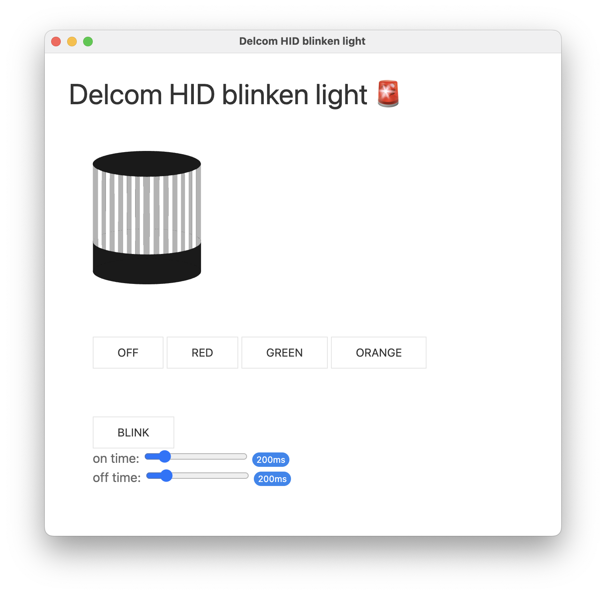

# electron test

The app does nothing... much & I mean it. Just a playground for messing with a node HID library to blink a Delcom light (this one I believe https://www.delcomproducts.com/products_USBLMP.asp)

If new to Electron, this app framework splits work into two pieces within the process - 

    chrome for ui 
    node for native backend. 
    
Communication between node and chrome is handled using ipcMain and ipcRenderer.

[main.js](main.js) contains the app's node functions and is responsible for init's the app/window and registering functions for 'ipcMain' which exposes them to the ui

[renderer.js](renderer.js) is for chrome and connects the button ids to messages sent using the ipcRenderer lib from electron. This setup allows the UI to asyc call functions in the node app.

[index.html](index.html) ...uh.. yah.. is the html :slightly_smiling_face: 

NOTE: In this app is indeed very stupid & ugly... but it will blink a light when plugged in ;)

